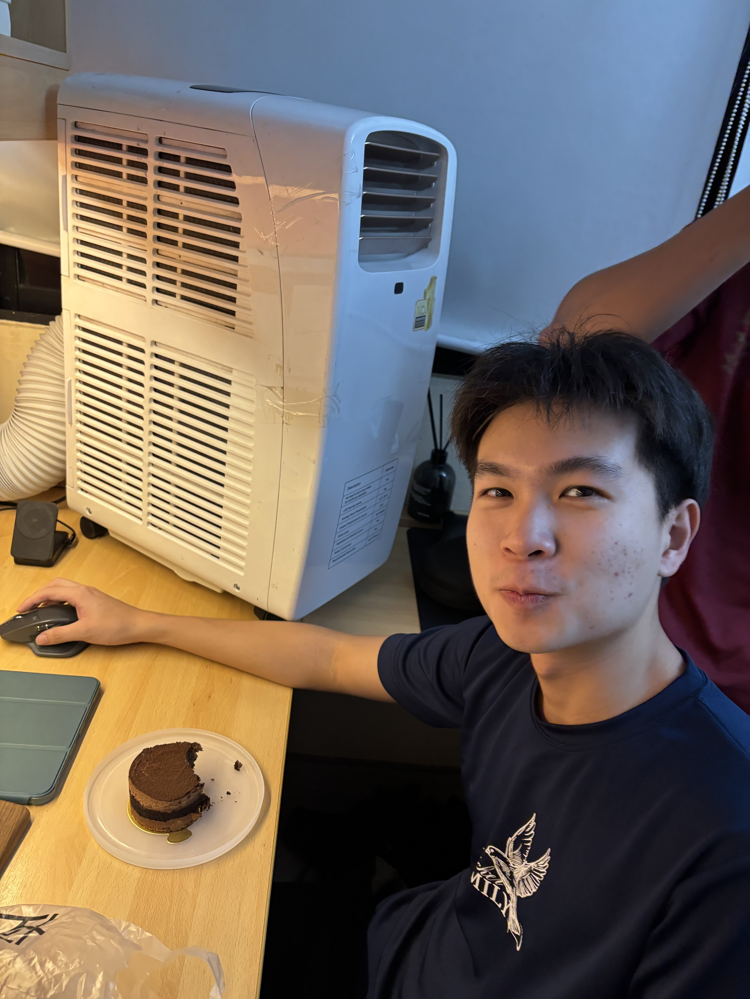
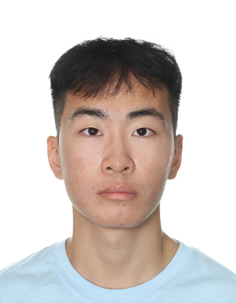
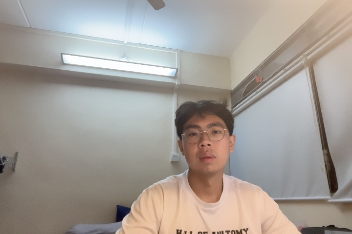
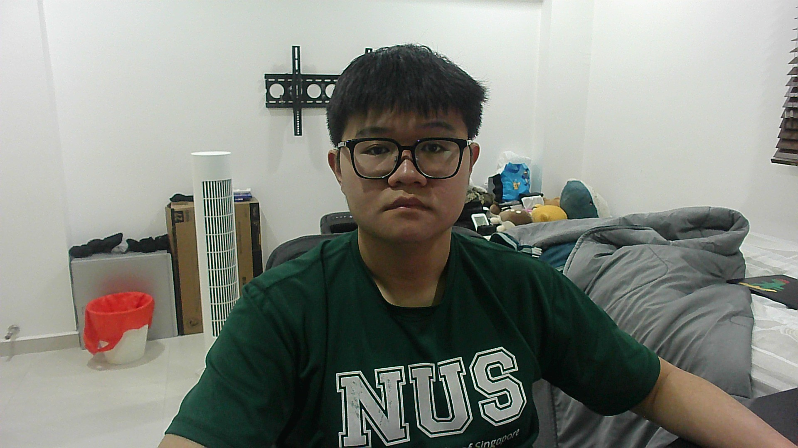
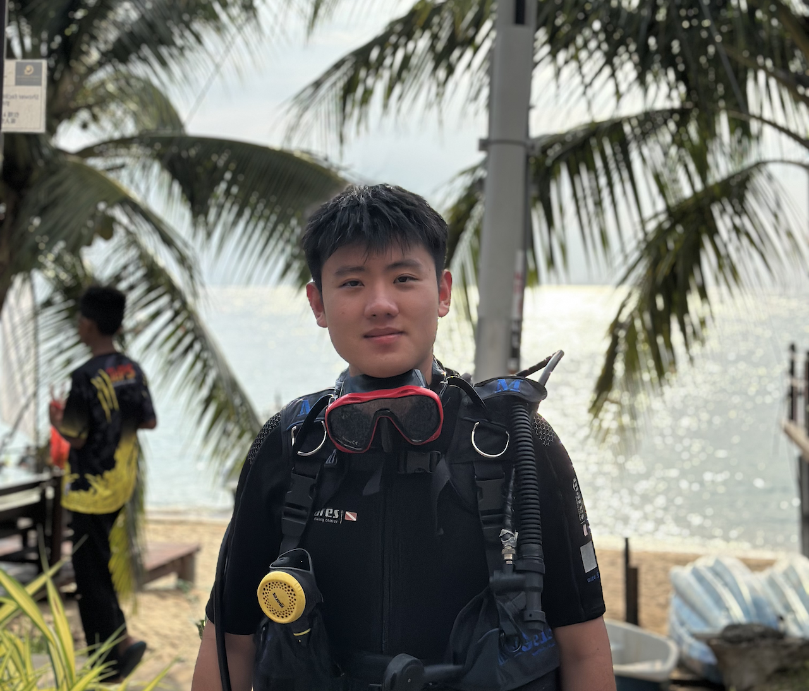

We are a team based in the [School of Computing, National University of Singapore](https://www.comp.nus.edu.sg).

You can reach us at the email `E1155502@u.nus.edu`

## Project team

### Jared See

[[github](https://github.com/jaredseezw)]
### Justin

[[github](http://github.com/xdJanaut)]
[[portfolio](team/xdjanaut.md)]

* Role: Project Advisor

### Junius Lui

[[github](http://github.com/juniuslui)]
[[portfolio](team/juniuslui.md)]

* Role: Team Lead
* Responsibilities: UI

### Jason Loh

[[github](http://github.com/imgorf)] [[portfolio](team/imgorf.md)]

* Role: Developer
* Responsibilities: Data

### Zhang Yangchuan

[[github](https://github.com/zyangchuan)]
[[portfolio](team/zyangchuan.md)]

* Role: Developer
* Responsibilities: Dev Ops + Threading
